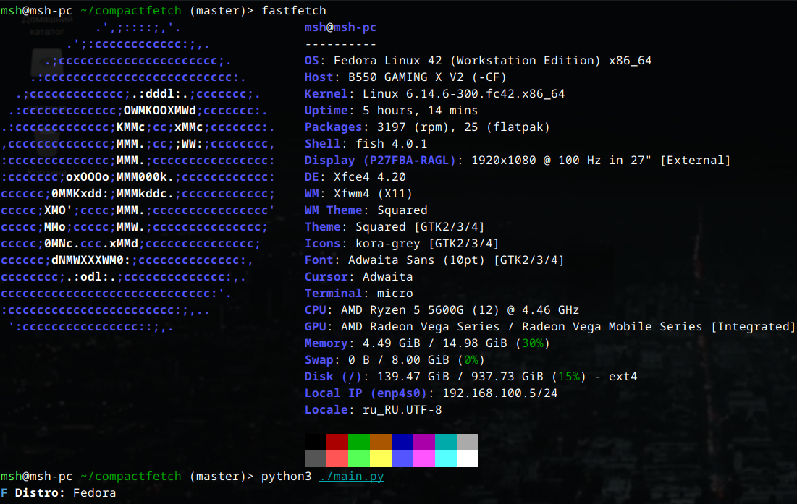

# compactfetch

<br>
Smallest ever fetch, that can exist, written in Python

## Using
### Method 1. Installing it
```
git clone https://github.com/msh356/compactfetch
cd compactfetch
chmod +x main.py
```
and run it:
```
./main.py
```
### Method 2. Using without install
Compactfetch can work anywhere from one Python file, so we can use it without installing:
```
curl -s https://raw.githubusercontent.com/msh356/compactfetch/refs/heads/master/main.py?token=GHSAT0AAAAAADECWOCXWTAXAK3OJCPRQ64Y2BJ2NIQ | python3 -
```
This command will get last compactfetch commit and run it.
